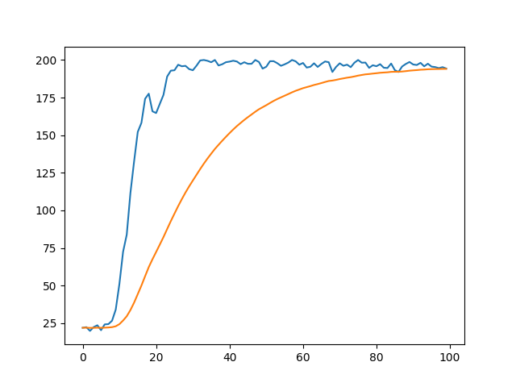
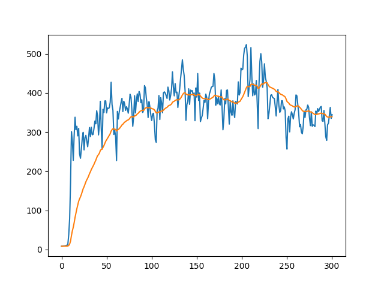

# rl-model

The implementation is based on [OpenAI Baselines](https://github.com/openai/baselines)

 

## Prerequisite

- tensorflow-1.8.0
- gym-0.10.5
- mujoco-py-1.50.1 (optional)

 

## Models

- Advantage Actor-Critic (A2C) (Original paper: [Asynchronous Methods for Deep Reinforcement Learning](https://arxiv.org/abs/1602.01783))
- Proximal Policy Optimization (PPO) (Original paper: [Proximal Policy Optimization Algorithms](https://arxiv.org/abs/1707.06347))

 

## Experiment Results

### Discrete:

- CartPole-v0

A2C|PPO
-|-
|

 

- MountainCar-v0

A2C|PPO
-|-
|

 

- Acrobot-v1

A2C|PPO
-|-
|

 
 

### Atari (Discrete):

- BreakoutNoFrameskip-v4

A2C|PPO
-|-
|

 

- PongNoFrameskip-v4

A2C|PPO
-|-
|

 

- SpaceInvadersNoFrameskip-v4

A2C|PPO
-|-
|

 
 

### Continuous:

- InvertedPendulum-v2

A2C|PPO
-|-
|

 

- InvertedDoublePendulum-v2

A2C|PPO
-|-
|

 

- BipedalWalker-v2

A2C|PPO
-|-
|

 

- HalfCheetah-v2

A2C|PPO
-|-
|

 

- Hopper-v2

A2C|PPO
-|-
|
